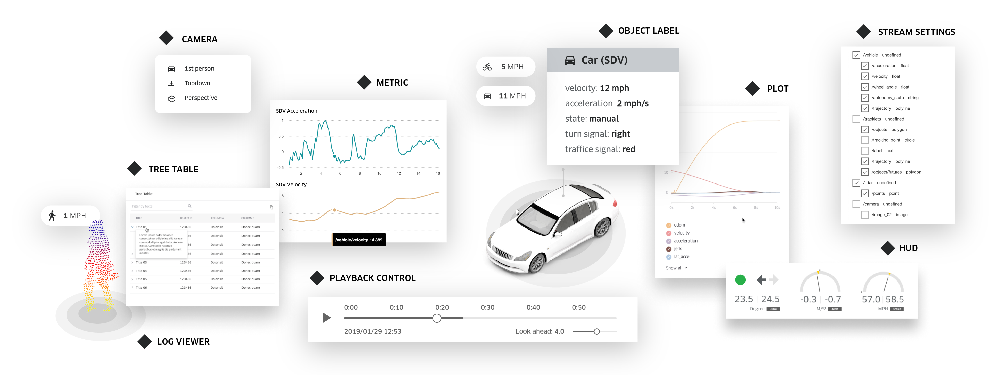

# AVS: Autonomous Visualization System

AVS is a new standard for describing and visualizing autonomous vehicle perception, motion, and
planning data, offering a powerful web-based toolkit to build applications for exploring,
interacting and, most critically, making important development decisions with that data.

The AVS projects are designed for applications and workflows that autonomy engineers and operators
work with to explore, analyze, and compare autonomous systems behavior and performance.

As a stand-alone, standardized visualization layer, AVS frees developers from having to build custom
visualization software for their autonomous vehicles. With AVS abstracting visualization, developers
can focus on core autonomy capabilities for drive systems, remote assistance, mapping, and
simulation.

We built our system around two key pieces: XVIZ provides the data (including management and
specification) while streetscape.gl is the component toolkit to power web applications.

## Components of AVS

### [XVIZ](https://github.com/uber/xviz/blob/master/docs/README.md)

We needed a formal and flexible specification for the data generated from autonomous systems, such
that the data format could integrate with evolving infrastructure, conform across multiple clients,
and be close enough to the source to define the necessary controls and bindings to efficiently
manage it.

XVIZ provides a stream-oriented view of a scene changing over time and a declarative user interface
display system. Like a video recording, you can randomly seek and understand the state of the world
at that point. Like an HTML document, it’s presentation is focused and structured according to a
schema that allows for introspection. However, XVIZ also allows for easy exploration and
interrogation of the data by tying together separate stream updates into a single object.

An XVIZ stream is a series of discrete updates that occur at a specific time with specific primitive
types. Primitives are objects that enable descriptions of information such as LiDAR point clouds,
camera images, object bounds, trajectories, vehicle speed over time, and predicted plans. To
simplify presentation for users, these objects can be individually styled (including at the stream
level) or assigned a style class.

XVIZ organizes streams through hierarchical naming, with a separate metadata section listing the
streams, their types, relative transforms, declarative UI panels, and style classes. The user
interface then bundles graphical panels for the objects with the data, providing the user with the
control via YAML to configure a series of layout and display components.

### [streetscape.gl](/docs/README.md)

streetscape.gl is a toolkit for building web applications that consume data in the XVIZ protocol. It
offers drop-in-ready components for visualizing XVIZ streams in 3D viewports, charts, tables,
videos, and more. It addresses common visualization pain points such as time synchronization across
streams, coordinate systems, cameras, dynamic styling, and interaction with 3D objects and cross
components, so that users can invest more time building out autonomous vehicle software itself.

Rendering performance is the top goal of streetscape.gl. Built on top of React and Uber’s mature
WebGL-powered visualization platform, we are able to support real-time playback and smooth
interaction with scenes supporting hundreds of thousands of geometries.

Composability is also front and center in the design of streetscape.gl. Learning from our work on
our internal visualization platform, which powers a dozen diverse use cases such as triaging,
labeling, debugging, remote assistance, and scene editing, we designed the components to be highly
styleable and extensible, so that any team can build an experience that is tailored to their unique
workflow.

## How AVS is different

AVS was designed to be open and modular, welcoming contributions from internal teams since the
beginning of its development to enable decoupling. Architecturally, it provides a layered approach
where the coupling between components of the autonomous stack is minimized and offers clear
definitions for the exchange of data. Each layer can evolve as needed without requiring system-wide
changes, and layers can be tailored for a specific context or us -case.

This guiding principle helps set AVS apart from current solutions. Specifically, AVS’ architecture
distinguishes itself because:

- It was designed with an intentional separation of data from any underlying platform
- Its limited, small specifications make tools easier to develop
- Its data format requirements result in fast transfer and processing

Additionally, we created AVS to meet the needs of everyone in the autonomy ecosystem, including
engineers, vehicle operators, analysts, and specialist developers. Autonomous engineers can describe
their systems with XVIZ easily, and then test and visualize their expectations with limited
overhead. Specialist developers can quickly build data source-agnostic applications with strong
performance characteristics and simplified integration using streetscape.gl. Lastly, operators can
view the data in standard visual formats, including videos, across multiple applications, leading to
easier collaboration, knowledge understanding, deeper analysis, and overall trust in the data
quality.

By open sourcing it to the industry, we encourage more to contribute and build upon this initial set
of ideas.

## Contact Us

Join our
[Slack channel](https://join.slack.com/t/streetscapexviz/shared_invite/enQtNTUyMDEwNzU4OTEyLTBjYTI0NzQ4MjZhNjkyMDY3Y2Q0YmVkMDlhMTJlODFmM2QwYjMzNTBhNmI3YzZhMjFhZjk5NmZhMTMzNDcwMzY)
for learning and discussions.

Interested in partnering? Contact us at
[avs-working-group@uber.com](mailto:avs-working-group@uber.com).
