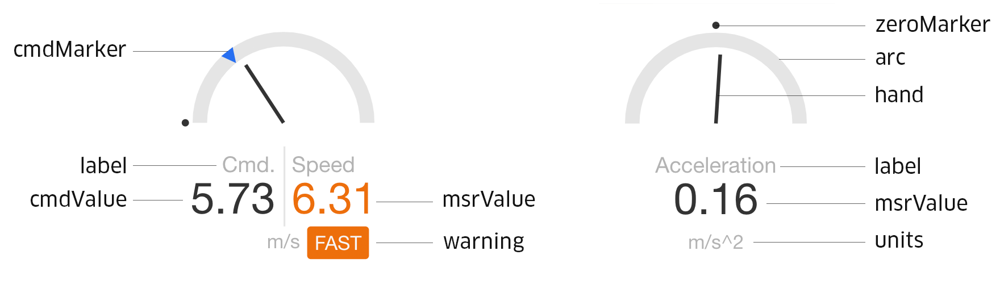

# MeterWidget (React Component)

Renders a widget that shows the current state of a numeric metric.



```jsx
import {MeterWidget} from 'streetscape.gl';

<MeterWidget
  log={log}
  cmdStreamName="/vehicle/velocity/commanded"
  streamName="/vehicle/velocity/measured"
  label="Speed"
  min={0}
  max={80}
  getWarning={v => (v > 60 ? 'speeding' : '')}
/>;
```

## Properties

##### log (XVIZLoader)

The log to edit - an [XVIZLoader](/docs/api-reference/xviz-loader-interface.md) object.

##### min (Number)

The lower bound of this metric.

##### max (Number)

The upper bound of this metric.

##### streamName (String)

The name of the variable stream that supplies the measured value of this metric.

##### cmdStreamName (String, optional)

The name of the variable stream that supplies the commanded value of this metric.

##### getWarning (Function, optional)

Validator callback. Receives a value, and returns a warning message or `null` if the value is within
range.

##### label (String, optional)

The display name of this metric.

##### precision (Number, optional)

The precision to display the values by.

##### transformValue (Function, optional)

Convert the value to a different format. For example, you may convert velocity from m/s to mph by:

```jsx
<MeterWidget
  ...
  transformValue={x => x * 3600 / 1609.344}
  units="MPH" />
```

##### units (String, optional)

The units of the metric. If not supplied, will fallback to the `units` field in the stream metadata.

##### style (Object, optional)

Custom CSS overrides of the control. Supports the following fields:

- `wrapper` (Object|Function) - the container of the widget.
- `arc` (Object|Function) - the arc of the guage. This is a SVG circle element.
- `arcRadius` (Number) - the radius of the arc.
- `arcWidth` (Number) - the stroke width of the arc.
- `hand` (Object|Function) the hand of the guage. This is a SVG line element.
- `zeroMarker` (Object|Function) the marker for zero on the guage. This is a SVG circle element.
- `cmdMarker` (Object|Function) the marker for the commanded value on the guage. This is a SVG path
  element.
- `cmdValue` (Object|Function) the text for the commanded value.
- `msrValue` (Object|Function) the text for the measured value.
- `label` (Object|Function) the label component.
- `units` (Object|Function) the units component.
- `warning` (Object|Function) the warning component.

If a function is supplied, will receive the following parameters:

- `props` (Object)
  - `theme` (Object) - the current theme.
  - `warning` (String) - the warning associated with the target value.
