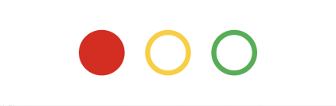

# TrafficLightWidget (React Component)

Renders a widget that shows the current state of traffic lights.



```jsx
import {TrafficLightWidget} from 'streetscape.gl';

<TrafficLightWidget log={log} streamName="/vehicle/traffic_light" />;
```

## Properties

##### log (XVIZLoader)

The log to edit - an [XVIZLoader](/docs/api-reference/xviz-loader-interface.md) object.

##### streamName (String)

The name of the variable stream that supplies the current state of the traffic lights. To show one
of the lights as on, the value is expeceted to be one of `red`, `yellow`, `green`. Use
`transformValue` if the stream is in a different scheme.

##### transformValue (Function, optional)

Callback to convert a value to the expected format.

##### style (Object, optional)

Custom CSS overrides of the control. Supports the following fields:

- `wrapper` (Object|Function) - the container of the widget.
- `layout` (String) - `horizontal` (default) or `vertical`.
- `light` (Object|Function) - each light component.

If a function is supplied, will receive the following parameters:

- `props` (Object)
  - `theme` (Object) - the current theme.
  - `color` (String) - the color of the target light.
  - `isOn` (Boolean) - if the target light is on.
